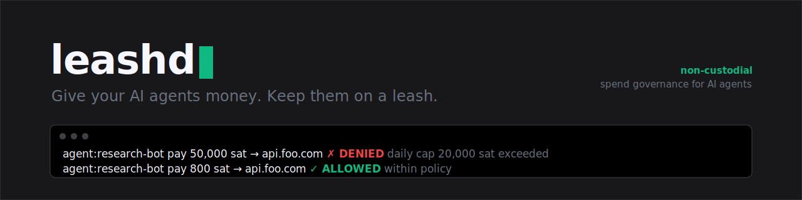

<p align="center">
  
</p>

<h3 align="center">Give your AI agents money. Keep them on a leash.</h3>

<p align="center">
  Non-custodial spend governance for autonomous AI agents.<br/>
  Budget caps, scoped credentials, kill-switch, signed audit trail. Bitcoin Lightning and Cashu ecash, Bitcoin-only. MCP-native.
</p>

<p align="center">
  <a href="./LICENSE"></a>
  <a href="https://github.com/brainbytes-dev/leashd/actions"></a>
  
  
  
  
  <a href="https://github.com/brainbytes-dev/leashd/stargazers"></a>
</p>

<p align="center">
  <a href="https://leashd.dev"><b>Website</b></a> ·
  <a href="https://leashd.dev/docs"><b>Docs</b></a> ·
  <a href="https://leashd.dev/faq"><b>FAQ</b></a> ·
  <a href="https://leashd.dev/community"><b>Community</b></a>
</p>

---

## The problem

Autonomous AI agents now discover services, buy compute, and pay other agents on their own. The moment you give an agent a wallet, one prompt injection, one dependency exploit, or one runaway loop can drain it. Probabilistic guardrails in the model are not a control. You need a deterministic gate between the agent and the money.

## What leashd is

leashd is a bouncer with a rulebook standing between your AI agent and your funds. The agent asks to pay, leashd checks your policy (budget left, recipient allowed, under the limit, kill-switch off), then authorises or blocks it, and writes every decision to a signed log. It is non-custodial: leashd runs on your own machine and holds your wallet connection locally. It never touches your funds or keys.

## How it works

```
  AI agent ──pay 50 sat──▶ leashd (your machine)
                              │  check policy (caps · allowlist · rate · kill-switch)
                              ├─ allowed ─▶ your wallet (NWC) ──▶ api.foo.com
                              ├─ capped / denied ─▶ structured refusal to the agent
                              └─ signed audit event ──▶ control plane feed
```

The agent never gets your wallet. It gets a policy-gated `pay` tool over MCP that points at leashd. Funds settle directly between your own wallet and the counterparty. leashd sits in the policy path, never the custody path.

## Features

| | |
|---|---|
| Budget caps | per transaction, per task, rolling hourly / daily / monthly |
| Scoped credentials | allowlists and denylists for endpoints, domains, Lightning addresses, mints |
| Rate limits | cap transactions per window |
| Time windows | only let agents spend when you allow |
| Approval thresholds | human-in-the-loop above a value you set |
| Graded shutdown | a dimmer, not just a kill-switch: attenuate scope, drop tools, escalate approvals |
| Signed audit trail | append-only, tamper-evident, exportable. EU AI Act Article 12 grade |
| Multi-rail | Bitcoin Lightning and L402, plus Cashu ecash. Bitcoin-only, no EVM or altcoins |
| MCP-native | drops into Claude Code or any MCP host |

## Quickstart

leashd is in early access. Install from source for now; a published one-line install is on the way.

```bash
# install from source (requires node >= 22.5 and pnpm)
git clone https://github.com/brainbytes-dev/leashd
cd leashd && pnpm install

# run leashd with your env (token + control plane URL)
LEASH_AGENT_TOKEN=lsh_live_xxxxxxxx \
LEASH_API_URL=https://leashd.dev \
pnpm --filter @repo/leashd dev
```

Wire it into Claude Code via `.mcp.json`:

```json
{
  "mcpServers": {
    "leashd": {
      "command": "leashd",
      "args": ["--mcp"],
      "env": {
        "LEASH_AGENT_TOKEN": "lsh_live_xxxxxxxx",
        "LEASH_API_URL": "https://leashd.dev"
      }
    }
  }
}
```

Then create a workspace and agent, set a policy, and your agent's `pay` calls are policy-gated. Full guide at [leashd.dev/docs](https://leashd.dev/docs).

## Architecture (open core)

leashd is open core. leashd (the program that runs on your machine) and the policy engine are open source under AGPL-3.0. The hosted control plane (policy authoring, audit aggregation, team, billing) is available at [leashd.dev](https://leashd.dev), and a commercial license is available (see [COMMERCIAL.md](./COMMERCIAL.md)).

```
packages/
  leash-core/   deterministic policy engine + shared contract (zod)
  leashd/       runs on your machine: MCP server, governor, rail adapters, audit
apps/
  web/          the control plane (Next.js)
```

Stack: TypeScript, Next.js, Turborepo, Drizzle, node:sqlite. Zero native build for leashd.

## Non-custodial by design

You hold the keys. leashd holds the policy. The control plane stores only policies and the audit log, never funds or keys. Even a full compromise of leashd, or of the control plane, cannot move your money, because the keys never leave your machine. leashd is not a money transmitter.

## Roadmap

- [x] Lightning / L402 rail, policy engine, MCP server, signed audit
- [x] Cashu ecash rail
- [x] Team and RBAC, audit CSV export
- [ ] Approval workflow UI, alerting, long audit retention

Bitcoin-only by design. No EVM, stablecoin, or altcoin rails. Ever.

## Contributing

PRs welcome. See [CONTRIBUTING.md](./CONTRIBUTING.md). The one invariant you must never break: leashd stays non-custodial. Report vulnerabilities per [SECURITY.md](./SECURITY.md).

## Support development

leashd is built in the open by an indie solo-dev. If it saves your agents from spending your sats, send some back:

```
⚡ leashd@walletofsatoshi.com   (TODO: replace with the real Lightning address)
```

A GitHub sponsor button is set up via [.github/FUNDING.yml](./.github/FUNDING.yml).

## License

[AGPL-3.0](./LICENSE). Commercial licenses available, see [COMMERCIAL.md](./COMMERCIAL.md).

<p align="center"><sub>Built by BrainBytes Studio, an indie solo-dev shop.</sub></p>
